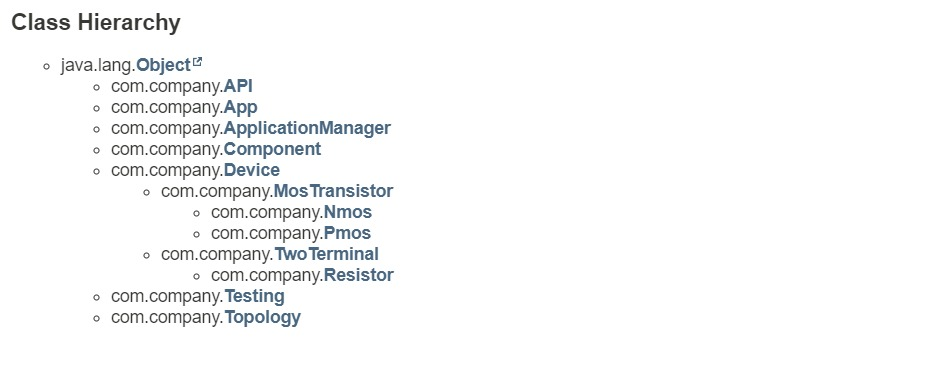
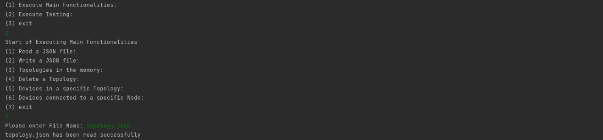
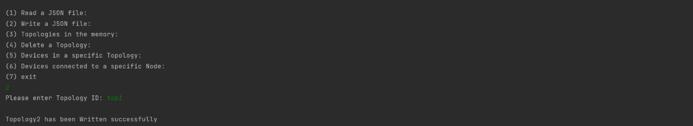
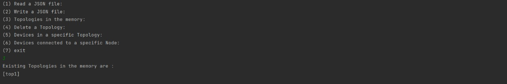
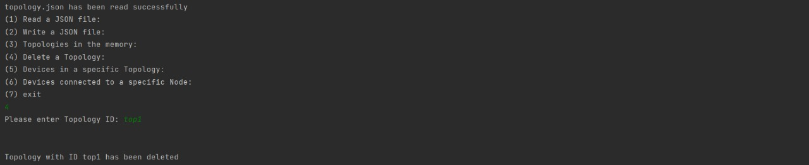
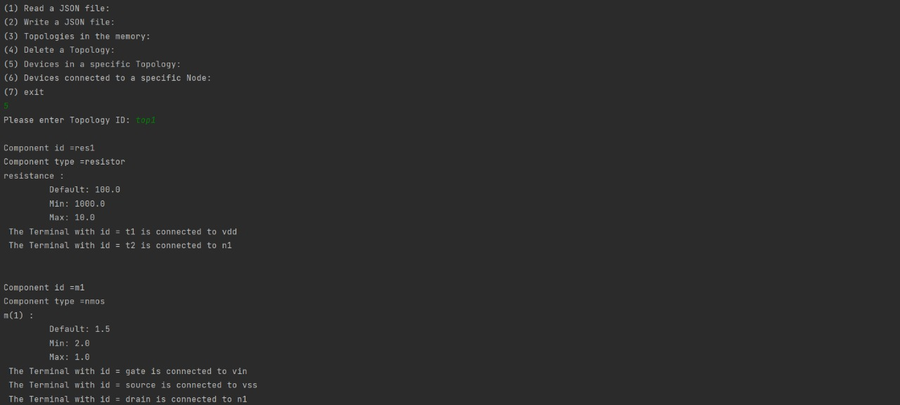
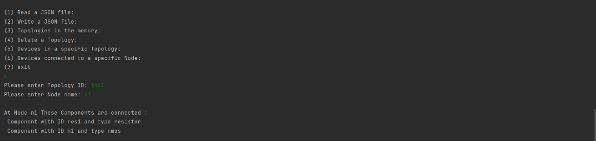
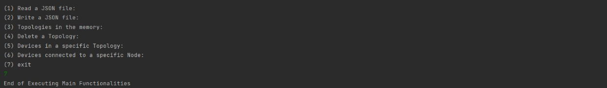
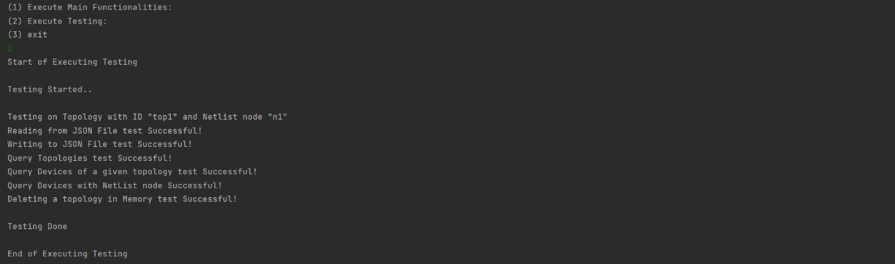

<div align="center">

# Topology API

</div>


<div align="center">

</div>

# 📙 About
An API library which provides the following functionalities of accessing, managing and storing device topologies.

# 📝 Description
<strong>This Library can make functionalities of :</strong>
1. Read a topology from a given JSON file and store it in the memory.
2. Write a given topology from the memory to a JSON file.
3. Query about which topologies are currently in the memory.
4. Delete a given topology from memory.
5. Query about which devices are in a given topology.
6. Query about which devices are connected to a given netlist node in
   a given topology.


# Class Structure



# 🏁 Getting Started

## Classes
### App

* This class creates an object from the ApplicationManager class which is used to call each functionality with its needed input
* It also creates an object from the Testing class which is used to test whole functionalities
* It contains a main loop of choosing functionalities on topologies or testing them then if functionalities is chosen
  we will go to the loop of choosing functionalities which is in the ApplicationManager class that we will discuss
### ApplicationManager 
*This class creates an object from the API class which is used to call the functionalities in API class
*It contains the main loop of the API which allows the user to select which operation to perform from API functionalities

### API

This class contains the memory of the API as a HashMap<String, Topology> where for each topology ID there is a Topology with all of it's data

* This class contains the functions of the API :-
    * boolean ReadTopology(String FileName)
    * boolean WriteTopology(String TopologyID)
    * Set<String> getTopologiesMemory()
    * boolean DeleteTopology(String TopologyId)
    * List<Component> queryDevices(String topologyID)
    * List<Component> queryDevicesWithNetlistNode(String TopologyID, String Node)

* Each functionality is validated completely in case User's input is invalid (if it's not in the memory)

### Topology

Each topology consists of :
* The ID of Topology
* list of components 
* JSON format of the topology with a unique ID 
* all nodes between each component in the topology

### Component

Each component consists of :
* Component ID  
* type of the component
* the device details 

### Device
Each Device contains:
* Name of the device 
* Default value 
* Min value 
* Max value

### TwoTerminal
* TwoTerminal class inherits from class device 
* TwoTerminal has an extra variable (TwoTerminalType) which determines if it's a resistor or capacitor or..(etc)
* It contains setter and getter for the Terminals (Nodes) of the device
* TwoTerminal class has setTwoTerminalType function that it's overridden in the children of this class
### Resistor
* The resistor inherits from TwoTerminal
* It overrides function setTwoTerminalType() to Determine the type of this two terminal device

### MosTransistor
* MosTransistor class inherits from class device
* MosTransistor has an extra variable (TransistorType) which determines if it's Nmos or Pmos
* It contains setter and getter for the Terminals (Nodes) of the device
* MosTransistor class has setTrasistorType function that it's overridden in the children of this class
### Nmos
* The Nmos inherits from MosTransistor
* It overrides function setTrasistorType() to Determine the type of this transistor

### Pmos
* The Pmos inherits from MosTransistor
* It overrides function setTrasistorType() to Determine the type of this transistor

### Testing

* This class tests each function of class API

## Dependencies

* Java
* Maven Framework Support
* json.simple

## Documentation

* Found in the index.html file inside the documentation folder

## 💻 Installing

```
git clone https://github.com/AbdelrahmanNoaman/Topology_Api
```

## 📷 Screenshots

####  Read a topology from a given JSON file and store it in the memory.


#### Write a given topology from the memory to a JSON file.


####  Query about which topologies are currently in the memory.



#### Delete a given topology from memory.


#### Query about which devices are in a given topology.


####  Query about which devices are connected to a given netlist node in a given topology.


#### Exit


#### Testing


## Contributors

<table>
<tr>
<td align="center">
<a href="https://github.com/AbdelrahmanNoaman" target="_black">
<br /><sub><b>Abdelrahman Noaman</b></sub></a><br />
</td>
</tr>
</table>

## License

This project is licensed under the [MIT] License - see the [LICENSE.md](LICENSE) file for details